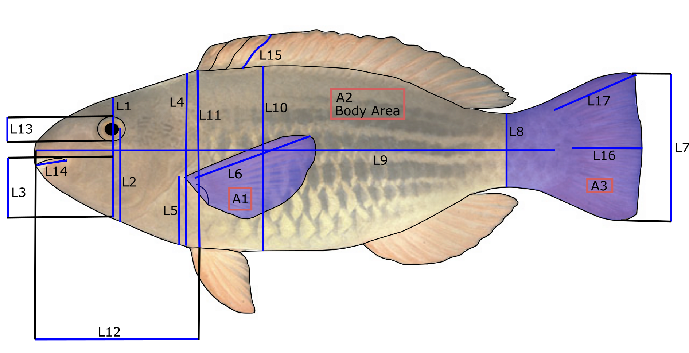

```{r setup, include=FALSE}
knitr::opts_chunk$set(echo = TRUE)
```

This document aims to provide a quick introduction to morphometric analyses and the comparison of methods on coral reef fish. The tutorial targets students and scientists in marine biology or ecology that have previous knowledge of the R software. It was created based on R version 3.6.3 and Momocs version 1.2.9.

It is the companion tutorial for the submitted paper 'Quitzau M., Frelat R., Bonhomme V., Möllmann C., Nagelkerke L., Bejarano S. How to describe the megadiversity of coral fish? Comparison and complementarity of three morphometric approaches'. See the "Material and Methods" section of the paper and the "Electronic supplementary materials" for more details about the method.

Please visit [Momocs speed dating](https://mran.microsoft.com/snapshot/2017-02-27/web/packages/Momocs/vignettes/Momocs_speed_dating.html) for a detailed introduction to modern morphometrics with the R package Momocs.

# Preliminaries
All the morphometrics analysis are carried out with the package `Momocs`[Momocs (v ≥ 1.2.9)](https://github.com/MomX/Momocs/).

```{r, message=FALSE}
library("Momocs")
```

If you get an error message, check that the R package `Momocs` is installed correctly. If not, use the command: `install.packages("Momocs")`.  

In the last section, we will also use the R packages `cluster`, and `corrplot`. If not installed, you can install them with the following command: `install.packages(c("cluster", "corrplot"))` 

The dataset of coral reef fish is available in the Rdata file `CoralFishes.Rdata`, available for download [here](https://github.com/rfrelat/CoralFish/raw/master/CoralFishes.zip).

# Dataset

Make sure the file `CoralFishes.Rdata` is in your working directory, then load it in R
```{r, message=FALSE}
load("CoralFishes.Rdata")
```

The file `CoralFishes.Rdata` contains the morphological information of 112 images of fish. It comprises the morphological traits and general information about the taxonomy (stored in the object `traits`), the coordinates of landmarks (stored in the object `landmarks`), and the outlines (stored in the object `outlines`).

```{r}
table(traits$family)
```

The dataset covers 41 species from 3 families. 26 individuals belong to the surgeonfishes (Acanthuridae), 76 to the parrotfishes (Scaridae), and 10 to the rabitfishes (Siganidae). Hereinafter, the outlines of the images are shown with families Acanthuridae, Scaridae, and Siganidae colored in red, blue, and green respectively.

```{r}
# Set the color for each family
palF<-c("#dc322f", "#497dcb", "#85995e")
# Attribute a color per image
colF <- palF[traits$family]

#Represent the outline of all the images
panel(outlines, col=colF)
```


# Traditional Morphometric (TM)

The traditional morphometrics (TM) investigates shape using ratios between lengths, angles, or areas measured on body parts. These ratios, also called morphological traits, often relate directly to functions of individuals, e.g. locomotion or diet.

The object 'traits' contains the 13 morphological traits related to food acquisition or locomotion.

```{r, echo=TRUE}
#remove the species and family information
traitsonly <- traits[, 3:15]
names(traitsonly)
```

{#id .class width=70%}


Traits | Formula | Description  
-------|---------|-----------------------------  
BodyAR | L10$^2$/A2 | Body aspect ratio, ratio between the body depth squared (L10), and the body area (A2).
CaudalAR | L7$^2$/A3 | Aspect ratio of the caudal fin, ratio of the caudal fin depth squared (L7), and the caudal fin surface (A3) 
CaudalFL | L16/L17 | Medial caudal fin ray length, ratio between the medial caudal fin ray length (L16), and the longest caudal fin ray length (L17)  
CaudalPT | L7/L8 | Caudal peduncle throttling, ratio between the caudal fin depth (L7), and the caudal peduncle minimal depth (L8)  
DorsalS | L15/L10 | Longest dorsal spine, ratio between the longest dorsal spine (L15), and the maximum body depth (L10)  
EyeP   | L2/L1   | Eye position, ratio between distance of eye and the bottom of the head (L2), and the head depth along the vertical axis of the eye (L1)
EyeS | L13/L1 | Eye size, ratio between the eye diameter (L13), and the head depth along the vertical axis of the eye (L1)
HeadD | L11/L10 | Head depth, ratio between the head depth (L11), and the body depth (L10)
HeadL | L12/L9 | Head length, ratio between the head length (L12), and the standard length (L9) 
LJawL | L14/L12 | Lower jaw length, ratio between the lower jaw length (L14), and the head length (L12)
OralGP | L3/L1 | Oral gape position, ratio between the distance from the top of the mouth to the bottom of the head along the head depth axis (L3), and the head depth along the vertical axis of  the eye (L1) PectoAR | L6$^2$/A1 | Aspect ratio of the pectoral fin, ratio between the squared pectoral fin length (L6), and the pectoral fin surface (A1)  
PectoP | L5/L4 | Pectoral fin position, ratio between the distance  of the intersection of their pectoral fin to the bottom of the body (L5), and the body depth at the level of the pectoral fin insertion (L4)

From the 13 calculated morphological traits, we calculate a principal component analysis (PCA) and visualize it with:

```{r}
# Run a PCA on the traits
pcaTM   <- PCA(traitsonly)
# Visualize the morphospace
plot(pcaTM, col=colF, cex=1.3)
```

Each dot represents one image located in the morphospace based on their loading on the principal components (PC).  The distance between images in the morphospace describes their morphological distances, in other words how two images are morphological similar in term of measured morphological variation. The colors indicate their family. As indicated by the axes labels, the first PC explains 29% of the variance, the second and third PC capture 16% and 11% respectively.

The PC are interpreted based on the loading of the traits. We can visualize them with a barplot().

```{r, fig.asp=1.5}
par(mfrow=c(3,1), mar=c(2,5,3,1), las=1)
barplot(sort(pcaTM$rotation[,1]), 
        horiz=TRUE, main="PC1")
barplot(sort(pcaTM$rotation[,2]), 
        horiz=TRUE, main="PC2")
barplot(sort(pcaTM$rotation[,3]), 
        horiz=TRUE, main="PC3")
```


The first component describes the elongation of the body and the head size. With high score on PC1, species have high values of head length (HeadL), head depth (HeadD), oral gape position (OralGP) and relatively low values for body aspect ratio (BodyAR), caudal peduncle throttling (CaudalPT).In other words, individuals with positive score on PC1 have an elongated body, a relatively larger head (in relation to standard length and body depth), and a caudal peduncle relatively broad compared to the caudal fin depth. On the contrary, species with negative score on PC1 have a more rounded body (nearly as deep as long), with relatively smaller head and a narrower caudal peduncle.

The second component highlights the eye size (EyeS) and position (EyeP), as well as, the pectoral fin position (PectoP). PC2 is characterized by a negative correlation with the eye size and a positive correlation of the eye and pectoral fin position. Fish with negative loading therefore have high values of eye size and low values of eye and pectoral fin position. Opposite applies for fish with positive loading. This results in fish with large, centered eyes and more ventral pectoral fins on the one hand, and fish with smaller, higher positioned eyes and centered pectoral fins on the other hand.

Lastly, the third component is about the fin development and the resulting swimming style, which is either based on the dorsal and pectoral fin, or the caudal fin. Fish with positive scores have higher values for eye size (EyeS) and a higher aspect ratio of the pectoral fin (PectoAR). Fish with negative scores have higher values for the dorsal spine (DorsalS) and the caudal fin length (CaudalFL)(i.e. the ratio between the medial caudal fin ray and the longest caudal fin ray, indicating an either straight or curved caudal fin). This shows the trade-off between fish with large dorsal spines, straight caudal fins, small eyes, and long and narrow pectoral fins (dorsal-pectoral based swimming), vs. fish with small dorsal spines, curved caudal fins, larger eyes, and short and broad pectoral fins (caudal fin swimming).

# Landmarks Analysis (LA)

The landmarks analysis (LA) is based on coordinates of landmarks, identified as homologous points that can be defined on all individuals within a population. The object `landmarks` contains the coordinates of landmarks:

```{r}
# Here we plot the landmarks of Scarus chameleon
# 47th image of our dataset
ldk_plot(landmarks[47], pch=16, cex=1.2, centroid=FALSE)
ldk_labels(landmarks[47], cex = 1.1)
```

Landmarks number| Description of its position  
----------------| ---------------------------  
1| Posterior-ventral margin of the distal arm of the maxilla  
2| Most anterior proximal limit between the premaxilla and the head of the maxilla  
3| Insertion of the most anterior ray of the dorsal fin on the body  
4| Insertion of the most posterior ray of the dorsal fin on the body  
5| Dorsal insertion of the caudal fin  
6| Ventral insertion of the caudal fin  
7| Insertion of the first ray of the anal fin  
8| Insertion of the last ray of the anal fin  
9| Anterior-dorsal insertion of the pectoral fin  
10| Posterior-ventral insertion of the pectoral fin  
11| Most anterior point on the eye  
12| Most posterior point on the eye  

A common problem in morphometrics is how to remove the information of size and rotation from the landmarks. Here, we chose to normalize landmarks using a full generalized Procrustes adjustment, i.e. finding the optimal superimposition of the images based on the landmarks.

```{r, message=FALSE}
ldkPro <- fgProcrustes(landmarks)
```

We can illustrate the Procrustes adjustment by looking at the superimposition of the landmarks of all images before and after the generalized Procrustes adjustment. 
```{r, message=FALSE}
par(mfrow=c(1,2))
stack(landmarks, title="before")
stack(ldkPro, title="after")
```

On the coordinates of the 12 landmarks, we calculate a PCA and visualize it with:

```{r}
# Compute PCA for the landmarks coordinates  
pcaLA <- PCA(ldkPro)

# Visualize the morphological space defined by PC1 and PC2
plot(pcaLA, col=colF, cex=1.3)
```

The grey dots are theoretical positions of landmarks calculated from the loading of the landmarks on the PCs. Each colored dot represents one image located in the morphospace, and colored by family. As indicated by the axes labels, the first PC explains 66% of the variance, the second and third PC capture 11% and 6% respectively.

A closer look at the deformation grids along the PCs can help their interpretation. We can visualize the contribution of the three first PCs with the home made function `PCldkContrib()` (loaded from the `CoralFishes.Rdata` file).

```{r, fig.asp=0.6}
 par(mar=c(1,1,0,0), cex=1.5)
 PCldkContrib(pcaLA, ldkPro, nax = 1:3, liney=1, linex=1)
```

The first component describes the elongation of the body and head depth, and caudal peduncle. This observation is based on the overall polygon bounded by the extreme landmarks (landmarks 2, 3, 5, 6, and 8). Additionally, the landmarks of the head (landmarks 1-3 and 11-12) are further apart in fish with negative loading on PC1 and narrow on the other side. From left to right, the landmarks of the eye (11+12) come closer to the landmarks of the mouth (1+2), the dorsal fin insertion (3) and the anal fin insertion (8) drift to a more posterior position, and the landmarks around the caudal peduncle (4-7) become broader.

The second component highlights the eye-mouth, as well as, the pectoral-anal fin distance, and variance in the caudal peduncle. In fish with negative scores on PC2 the landmarks of the mouth (1+2) are closer to the landmarks of the eye (11+12), than in fish with positive scores. Additionally, the pectoral fin (landmarks 9+10) is closer to the anal fin (8) in positive fish and the angle between these two fins is steeper. Fish with positive scores tend to have a more trapezoid caudal peduncle (landmarks 4-7), while the caudal peduncle from fish with negative scores are more straight.

The third component is about the eye size, the mouth-pectoral fin relation, and the caudal peduncle. Fish with negative scores on PC3 have have larger eyes, i.e. a higher distance between landmarks 11 and 12, compared to fish with positive scores on PC3. The mouth (landmarks 1+2) and the pectoral fin (landmarks 9-10) are at level in fish with positive scores, while the mouth is higher than the pectoral fin insertion in fish with negative scores on PC3. Again, a difference is found in the caudal peduncle (landmarks 4-7), which broadens along PC3.

# Outline Analysis (OA)

The outline analysis (OA) describes the coordinates of points along the outline of organism through mathematical functions. The object `outlines` contains the outline of 112 images of fish.

To remove the information of size and rotation from the outlines, we identified five landmarks: (1) ventral insertion of the caudal fin; (2) insertion of the pelvic fin; (3) snout tip; (4) anterior insertion of the dorsal fin; (5) dorsal insertion of the caudal fin. The third landmark (snout tip) is used as the starting point of the outline (see  [Fish outline analysis with R](https://rfrelat.github.io/FishMorpho.html) for more details).

We can visualize the outline and their landmarks, using the same image of Scarus chameleon

```{r}
# Here we plot the outline of Scarus chameleon
# 47th image of our dataset
coo_plot(outlines[47], xy.axis=FALSE)

# Add the landmarks position
points(outlines[47][outlines$ldk[[47]],], pch="+", 
       col="red", cex=2)
# and their label
text(outlines[47][outlines$ldk[[47]],], labels = 1:5, 
     col="red", pos=c(1,1,4,3,3), cex=1.5)
```

Similar to LA, we used a full generalized Procrustes adjustment to  align the images and remove differences in size and rotation.

```{r , message=FALSE}
outPro <- fgProcrustes(outlines)
```

We can visualize how the Procrustes adjustment improved the comparability of the outlines by looking at the superimposition of the outlines before and after Procrustes adjustment.

```{r, message=FALSE}
par(mfrow=c(1,2))
stack(outlines, title="before")
stack(outPro, title="after")
```

Now we perform an Elliptical Fourier transforms. The mathematics behind elliptical Fourier transforms (EFT) are detailed in [Bonhomme et al. 2014 _Journal of Statistical Software_](https://www.jstatsoft.org/article/view/v056i13). The main idea of EFT is to consider the outline as two periodic functions in x and y, that can be decomposed by Fourier transforms.

The first step is to know how many harmonics are needed to describe the outlines.

```{r}
calibrate_harmonicpower_efourier(outPro, nb.h=100)
```

With 15 harmonics, 99% of the shape is correctly described. So we can run the Elliptical Fourier analysis with 15 harmonics (`nb.h =15`).

```{r}
fish_efa <- efourier(outPro, norm = FALSE, nb.h = 15)
```

From the harmonic coefficients of the 15 harmonics, we can calculate a PCA.

```{r}
#Run a PCA
pcaOA <- PCA(fish_efa)
```

To help comparability across approaches, we decided to multiply the PC loadings by (-1). This operation doesn't affect the result and interpretation of the PCA - but it will help when comparing the approaches.
```{r}
#adjust sign of PC1
pcaOA$x[,1]<- -pcaOA$x[,1]
pcaOA$rotation[,1]<- -pcaOA$rotation[,1]
```

```{r}
#Visualize the morphospace
plot(pcaOA, col=colF, cex = 1.5, 
     xlim=range(pcaOA$x[,1]),
     ylim=range(pcaOA$x[,2]))
```

The grey shapes are theoretical shapes regularly drawn on the factorial plane. Each dot, located in space based on the loading of the harmonics on each component, represents one picture and they're colored by family. As indicated by the axes labels, the first PC explains 39% of the variance, the second and third PC capture 20% and 16% respectively.

Looking at the variation of shapes along the PCs can help their interpretation. We can visualize the contribution of the three first PCs:

```{r, fig.asp=0.6}
PCcontrib(pcaOA, nax = 1:3,gap = 0.8)
```

The first component describes the elongation of the body and the anal fin position. The overall shape shifts from an elongated ellipse to nearly a circle. Linked to that, the gap between the pelvic and the anal fin is greater in elongated fish, than in rounded.

The second component highlights the development of the caudal fin as well as the head shape, including the position of the mouth (possible due to 5 landmarks). The caudal fin is curved for individuals with negative scores and rather straight for positive individuals. The head varies from a deeper, but shorter head with a mouth located further to the bottom of the head, to a pointed head with a centered mouth. The head and caudal fin contribute to another shift in elongation along PC2.

The third component is about the size of the fins. The fins of fish with positive scores on this axis were relatively more developed than fish with negative scores. The strongest difference occurred in the pelvic fin, with positive scores result in a highly distinct pelvic fin while the smaller pelvic fin of individuals with negative scores is placed closer to the body.

# Morphospace comparison

The comparison of methods can be succeeded with different methods. First, we concentrated on the PCs themselves. We compute a correlation matrix, based on Pearson correlation coefficients, to investigate whether the Principal components of each method capture the same morphological variability among individuals. Then we also investigated the degree of separation among the morphospace of known taxonomic and functional groups. 

## Correlation Matrix

Computing a correlation matrix gives the opportunity to compare whether PCs describe the same variance, i.e. are highly correlated.

```{r, message=FALSE}
res <- cbind(pcaTM$x[, 1:3], 
             pcaLA$x[, 1:3], 
             pcaOA$x[, 1:3])
colnames(res)<- paste(rep(c("TM", "LA", "OA"), each=3), 
                      rep(c("PC1", "PC2", "PC3"), 3), sep="\n")

corrplot::corrplot.mixed(cor(res), upper="number", lower="ellipse")
```

The correlation matrix is divided into the correlation values (upper right) and ellipses derived from scatterplots (bottom left). Blue values and ellipses indicate positive correlations and the red ones negative correlations. The intensity of the color is based in the strength of the correlation.

The highest correlation is found between the first PCs of TM and LA, which are both highly correlated with the first PC of OA. This correlation reflects the main morphological variation of nominally herbivorous coral reef fish, which is linked to body elongation. Interestingly, OA separates the information of elongation in 2 components, whereas the first PCs of TM and LA correlated additionally with PC2 of OA. The correlation of the third PCs of TM and OA, and the PC2 of LA highlights variances in fin shapes, covering the dorsal, pectoral and anal fin.

## Differentiation of taxonomic groups

Secondly, a way to compare morphometric methods is to investigate the ability to capture the taxonomy grouping of the fish based on morphology. Here we use the taxonomic unit "family":

```{r}
par(mfrow = c(3,2))
#TM
plot(pcaTM, fac=traits$family, eigen = FALSE)
plot(pcaTM, fac=traits$family, eigen = FALSE, yax = 3)

#LA
plot(pcaLA, fac=traits$family, 
     morphospace = FALSE, eigen = FALSE)
plot(pcaLA, fac=traits$family, eigen = FALSE,
     morphospace = FALSE, yax = 3)

#OA
plot(pcaOA, fac=traits$family, 
     morphospace = FALSE, eigen = FALSE)
plot(pcaOA, fac=traits$family, eigen = FALSE,
     morphospace = FALSE, yax = 3)
```

The methods discriminate between families. The family Acanthuridae is displayed in red, Scaridae in blue, and Siganidae in green. A continuum from parrotfish (Scaridae) to rabbitfish (Siganidae), to surgeonfish (Acanthuridae) is detected by all three methods. The family Acanthuridae is relatively widespread using OA, which can be explained by the fact, that OA detects variances in elongation with PC1 and PC2. Additionally, the detection of the highly curved caudal fin (e.g. genus *Acanthurus*) spreads the family across the morphospace. The family Siganidae is separated from the Acanthuridae by the second and third PC. OA shows most overlap of groups. Also TM shows overlap between Acanthuridae and Siganidae. LA results in the most distinct groups with no overlap. 

## Quantification of differentiation

In addition to the visual interpretation with the convex hull in the morphospace,we can quantify the degree of differentiation among taxonomic groups by calculating silhouette. The silhouette is based on the difference between the average distance within groups (here families) (cohesion) and the average distances to neighbor group (separation). The silhouette ranges from -1 to +1 with higher values indicating a higher clustering quality. 


```{r}
#Transform family into categorical numbers
fam <- as.numeric(traits$family)

#Compute the silhouette for each morphospace
sTM <- cluster::silhouette(fam, dist(pcaTM$x[, 1:3]))
sLA <- cluster::silhouette(fam, dist(pcaLA$x[, 1:3]))
sOA <- cluster::silhouette(fam, dist(pcaOA$x[, 1:3]))

#Average silhouette value for TM    
summary(sTM)$avg.width
#Average silhouette value for LA    
summary(sLA)$avg.width
#Average silhouette value for OA    
summary(sOA)$avg.width
```

The silhouette value confirms the visual observation of the convex hull in the morphospaces. All methods have relatively high silhouette value (>0.4) so they are able to differentiate the families in the morphospace, while LA shows the highest separation among families with a silhouette of 0.65.


# References

Bonhomme, V., Picq, S., Gaucherel, C. & Claude, J. Momocs: Outline Analysis Using R. J. Stat. Softw. 56, 1–24 (2014).

Caillon, F., Bonhomme, V., Möllmann, C. & Frelat, R. A morphometric dive into fish diversity. Ecosphere 9, 10 (2018).

